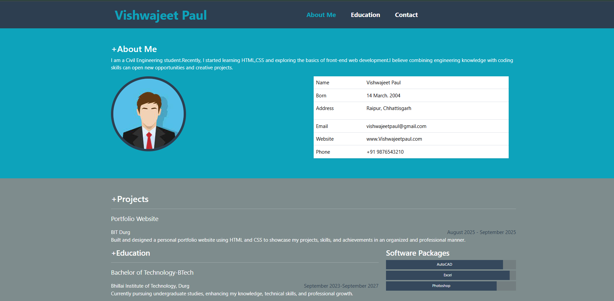
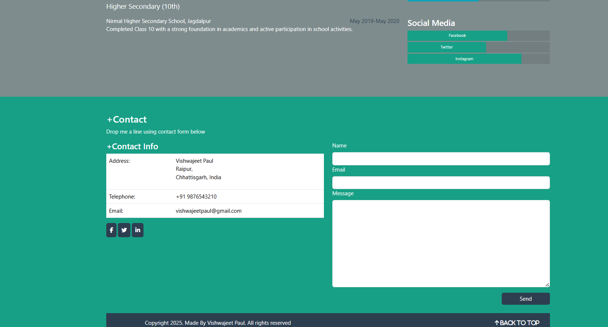

# Portfolio-Website

This is a simple **Portfolio Website** built using **HTML, CSS, and JavaScript**.  
It contains the following sections:  
- **About Me** – A short introduction  
- **Education** – My academic background  
- **Projects** – Some of my works and practice projects  
- **Contact** – Ways to Contact 

## 🖼️ Screenshot  

  

 
 

## 🚀 Features  
- Responsive design  
- Clean and minimal layout  
   

---
